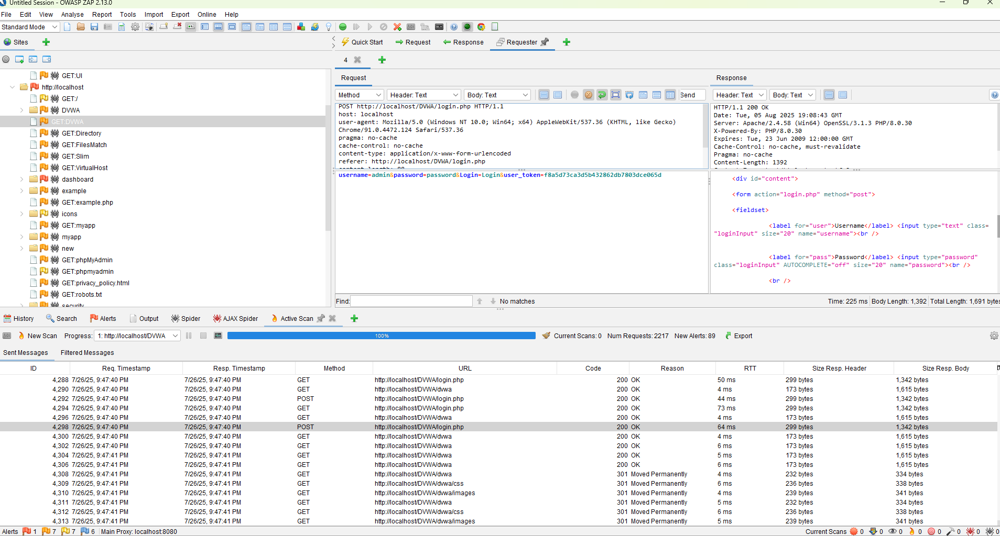
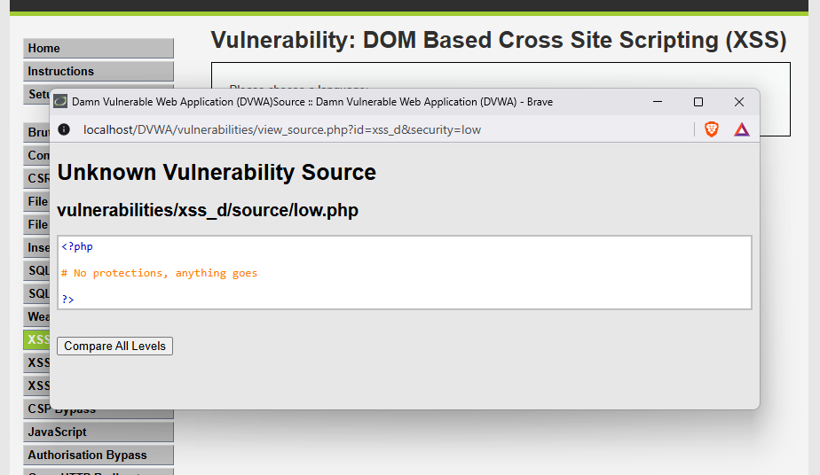
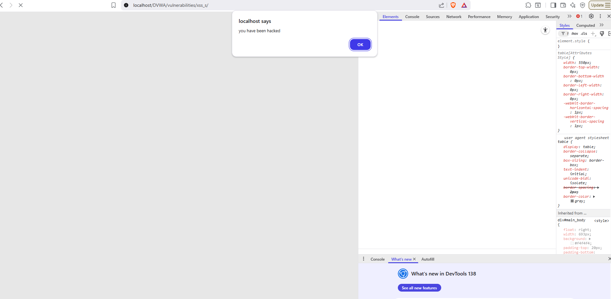

# FUTURE_CS_01
# 🧪 Web Application Testing Report – DVWA

## 1. Project Information

| Field             | Details                                      |
|------------------|----------------------------------------------|
| **Application**   | Damn Vulnerable Web Application (DVWA)       |
| **Test Date**     | [11/07/2025 – 11/08/2025]                      |                  |
| **Environment**   | Hostinger VPS/ XAAMP Windows                   | 
| **Security Level**| Low / Medium / High / Impossible             |
| **Tools Used**    | Burp Suite, OWASP ZAP, Nikto, curl, etc.     |

---

## 2. Test Objectives

- Identify and exploit vulnerabilities in DVWA modules.
- Validate known web application weaknesses.
- Practice manual and automated testing techniques.
- Demonstrate mitigation strategies for common security flaws.

---

## 3. Scope of Testing

**Modules Tested**
- [x] Brute Force  
- [x] Command Injection    
- [x] SQL Injection  
- [x] XSS (Reflected & Stored)  
- [x] Security Level Validation
- [x] File Inclusion


## 4. Methodology

| Aspect         | Description                                         |
|----------------|-----------------------------------------------------|
| **Approach**    | Manual testing with automated tool assistance      |
| **Test Types**  | Penetration Testing, Vulnerability Assessment      |
| **Tools Used**  | Burp Suite, OWASP ZAP, Nikto, browser devtools |
| **Security Levels Tested** | Low / Medium / High / Impossible        |

---

## 5. Summary of Findings

| Vulnerability         | Module            | Severity | Exploited | Status     | Notes                              |
|-----------------------|-------------------|----------|-----------|------------|------------------------------------|
| SQL Injection         | SQL Injection     | High     | ✅        | Confirmed  | `' OR 1=1--` exploited             |
| Stored XSS            | XSS (Stored)      | High     | ✅        | Confirmed  | Persistent `<script>` executed    |
| Reflected XSS         | XSS (Reflected)   | Medium   | ✅        | Confirmed  | Alert triggered                    |
| Command Injection     | Command Injection | High     | ✅        | Confirmed  | Executed OS commands via input    |        |
| Brute Force           | Brute Force       | Medium   | ✅        | Confirmed  | Weak creds discovered             |
| Local File Inclusion  | File Inclusion    | High     | ✅        | Confirmed  |Accessed `/etc/passwd,systeminfo`  |

---

## 6. Detailed Vulnerabilities

### 6.1.1  Nikto and OWASP

I used Nikto to scan for vulnerabilities on the webpage.. 
Nikto found a login.php databases and config files.

The same with the zap owasp to find files and pass syntaxes.




### 6.2 🛠️🔓 Brute Force Login Page

- **Module:** Brute Force  
- **Level:** Low-Impossible
- **Payload:** Dictionary Attack
- **Result:** Login Page accessed  
- **Mitigation:** Use stronger Password and implement strong password policies

#### 6.2.1 Hydra

i used hydra a bruteforcing tool to carry out a dictionary attack on the login.php to test for weak credentials if possible.


weak creds were found via my dictionary attack and i gained access to the webpage via the login form.


### 6.3 🧨 Command Injection

Command injection is a security vulnerability that allows an attacker to execute arbitrary operating system commands on the host machine running a vulnerable application

on the cloud i inputed commands like: 


```bash
google.com | pwd && whoami 
```
```bash
google.com | cat /etc/passwd
```
in similar fashion i accessed the systeminfo when i installed the DVWA on XAMP windows machine 

```bash
google.com | dir && systeminfo
```


### 6.4 🧨 SQL Injection

SQL injection (SQLi) is a web security vulnerability that allows an attacker to interfere with the queries an application makes to its database by injecting malicious SQL code into input fields.

##### Low Mode

```bash
first i tested the login page for a potential sql error with just closing the  syntax | ' and this created the error seen below and this let me know there was an error shown and a possilbe potential for a code injection
```


```bash
In easy mode i ran ( 1' OR '1'='1)
```


i found the number of existing columns by just inputing numbers 1 and i saw the two colums name and surname but one can also find this by inputing ' ORDER BY 1 and change numbers until failure, and that tells how manys columns are there.


```bash
'UNION SELECT users,password from users#
```


##### Medium Mode

Once again i check the source code in my Devtools and i saw the sqlsyntax and i noticed a filtration methoded added but the sql syntax remains the same but this time the id is not quoted previously i tried to esacpe the quote but this time there was no quote to escape.

from the devtool i ran the syntax below:
```bash
 1 or 1=1 UNION SELECT user,password from users#
```


##### High Mode

For the high mode on sql section i discovered checking the source code that session id was implemented but the sql syntax was similar to the one of the low mode where i had to escape quotes so i ran a similar syntax 

```bash
 1 or 1=1 UNION SELECT user,password from users#
```


### 6.5 💉  XSS 

#### 6.5.1 Dom Based XSS

DOM-based cross-site scripting (DOM XSS) is a type of cross-site scripting attack that occurs entirely within the Document Object Model (DOM) of a web page loaded in the user's browser.
 Unlike other XSS types, the malicious payload is not sent to the server; instead, the attack exploits vulnerabilities in client-side JavaScript code that processes user input from sources like the URL, fragment identifier, or other DOM properties and writes it to the page using unsafe methods

The vulnerability arises when a web application takes untrusted data from a source (such as document.URL, location.href, or document.referrer) and writes it directly to a sink (like document.write, innerHTML, eval, or setTimeout.

##### Low level

First i inspected the source code using the browser dev tools and below we are shown that on this level of security anything goes there is no fliter or form of security set.



So i selected a language and on the browser url i injected the script to create an alert of the current user cookie

```bash
 so after default= i injected the script <script>alert(document.cookie)</script>
```


##### Medium Level

Looking at the source code of the medium level dom xss we can see that a syntax or filter was applied to filter out script tags


```bash
 so i applied a script without the script tag and select option to breakout </select>
```


##### High Level

The source code high level security states that only allowed languages are allowed if not codes automatically goes to default language english.
so based on the instruction i had to find a way to run my code without it going to the server


```bash
 so i applied a script without the script tag and select option to breakout </select>
```


#### 6.5.2 Reflected  XSS

Reflected XSS, also known as non-persistent or Type-I XSS, is a web application vulnerability where malicious script is injected into a trusted website through a user request and immediately reflected back in the server's response without being stored.

##### Low level

For the low level here looking at the source code there was no filter or security set to script injectinos so i directly insected the script tag to reflect an alert on screen


```bash
 so i directly inserted the script tag to reflect you have been hacked on the screen <script>alert ('You have been hacked')</script>
```


##### Medium level

The source code on the medium level shows some filter applied to filter or strip script tags


```bash
 so since there was a code to filter anyword with the script but it did not filter the case of the letters so i used a capital letter S to bypass that  there are other methods to bypass this <Script>alert (document.cookie)</script>
<scri<script>pt>alert(document.cookie)</script>
```


##### High level

Looking at the source code on the high level we can see all patterns for scripts have been removed by the developer.


```bash
here we have a sript to strip and filter out every script tag including Case sensitive.. so here i used another syntax to bypass this i used the img error syntax

```


#### 6.5.3 Stored XSS

Stored XSS, also known as persistent or second-order XSS, is a type of cross-site scripting attack where malicious code is injected into a vulnerable web application and permanently stored on the target server, such as in a database, message forum, comment field, or visitor log.

##### low Level

For the low level on the stored xss its same with other low levels not much security or filter syntaxes included or implemented so we can indirectly insert or inject a typical xss script


```bash
<script>alert("you have been hacked")</script>
```



##### Medium Level

In the source code of the medium level we can see code sanitation syntax and filters added to forms.
But further examining the code i relaized that the snationt for the message section strips the whole script tag


```bash
i ran this script on the name section with Capital S cript since the didnt check for cases <Script>alert("you have been hacked")</script?
```


##### High Level

 Looking at the source code for the high level xss store  i noticed the filters add to both sections the message sections compeletly strips every syntax or data inputed but the name sections only strips the name script tag.
 So i used a different syntax for the name section i used the img call.

 

 ```bash

```


## 7. Tools Used

| Tool         | Purpose                          |
|--------------|----------------------------------|
| Burp Suite   | Proxy, request tampering         |
| OWASP ZAP    | Active vulnerability scanning    |
| Nikto        | Web server scanner               |
| curl         | HTTP request crafting            |
| Firefox DevTools | Input/output inspection      |


## 9. Recommendations

| Area              | Recommendation                                   |
|-------------------|--------------------------------------------------|
| Input Validation  | Sanitize and validate all user input server-side |
| Output Encoding   | Use HTML/JS escaping for outputs                 |
| File Handling     | Restrict file types, validate MIME types         |
| Authentication    | Implement rate limiting, strong password rules   |
| CSRF Protection   | Use CSRF tokens with same-site cookie flags      |
| Logging & Alerts  | Monitor unusual activity                         |


## 10. Conclusion

Exploiting the DVWA successfully demonstrated the impact of common web application vulnerabilities under various security levels. The hands-on testing reinforces best practices in secure coding, vulnerability mitigation, and the need for continuous security assessments in real-world applications.


