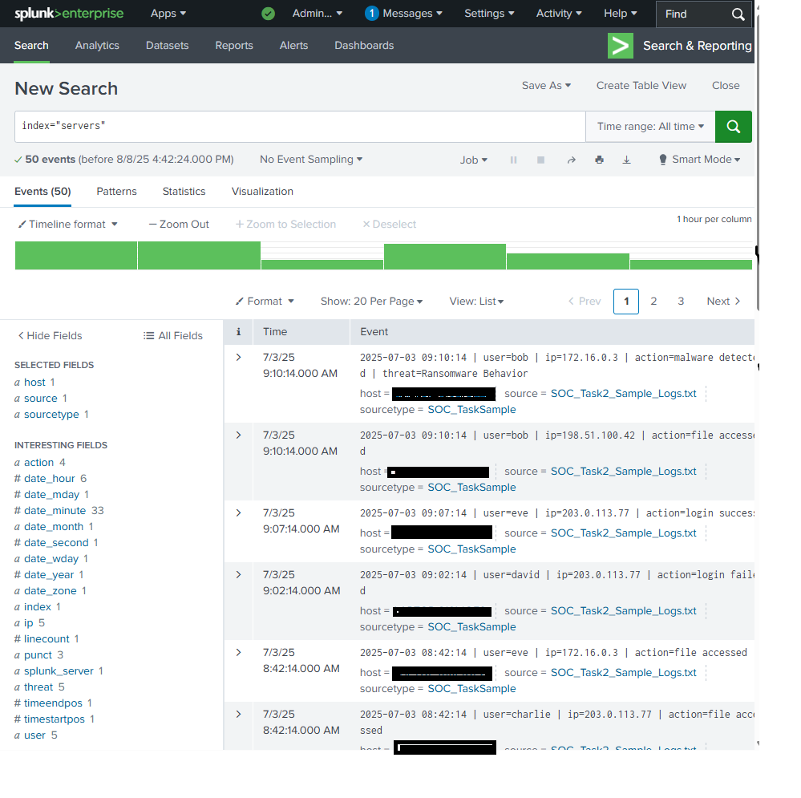
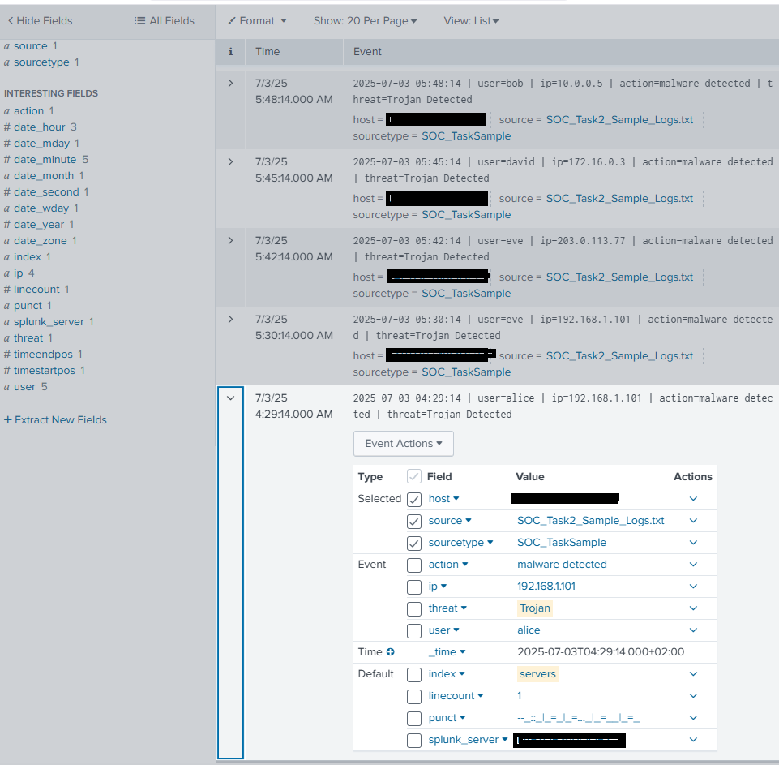
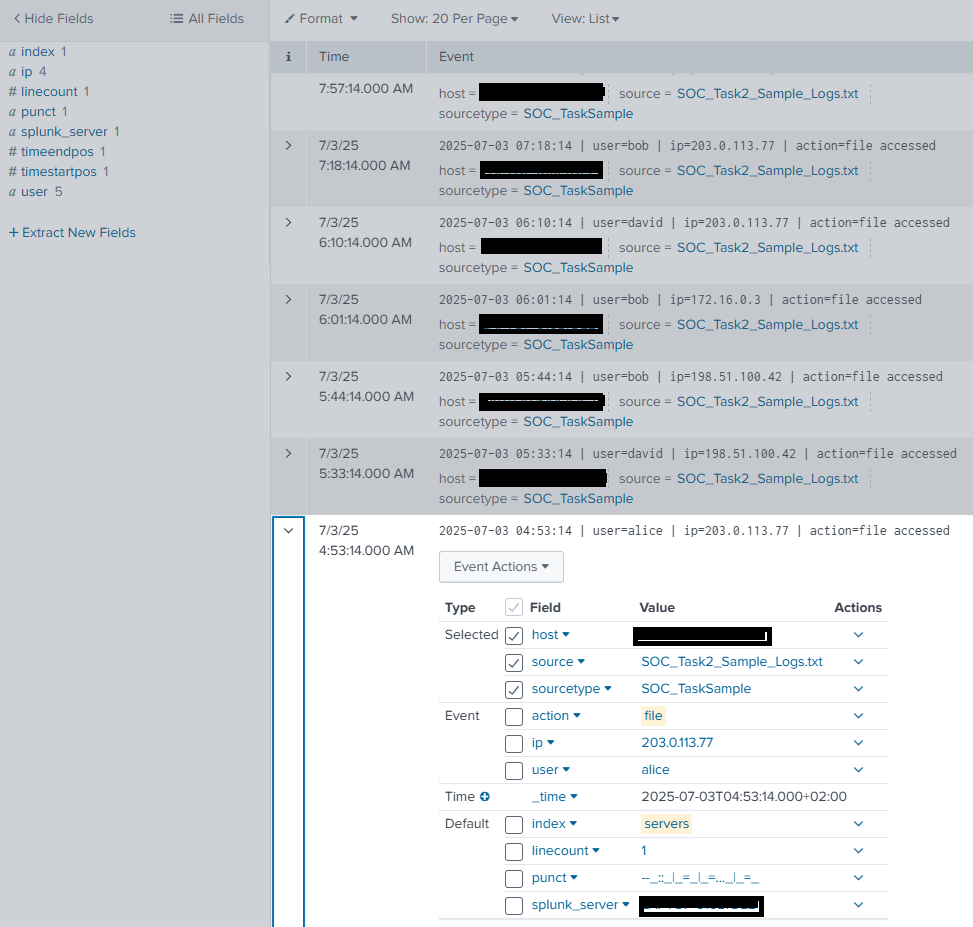
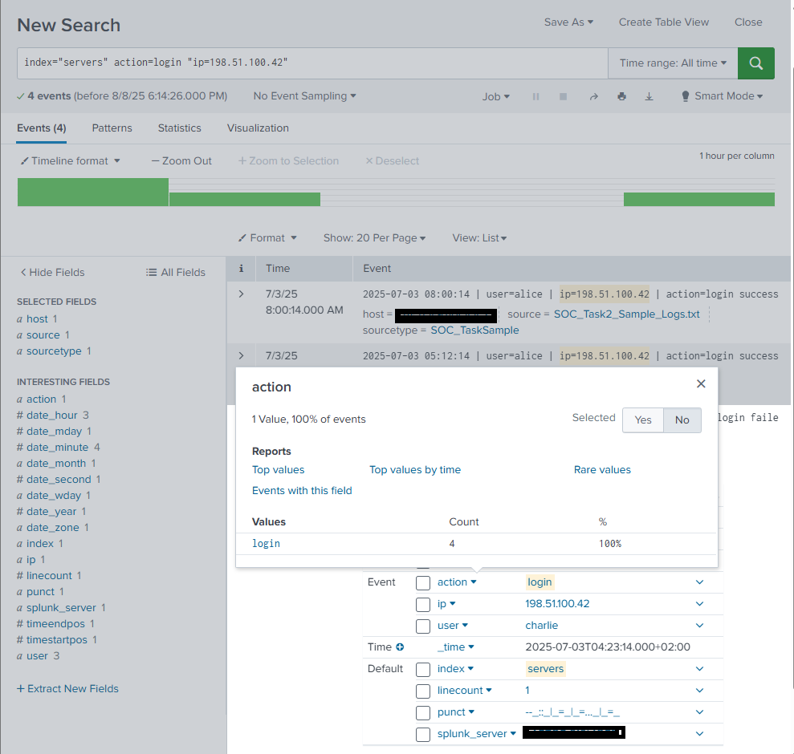
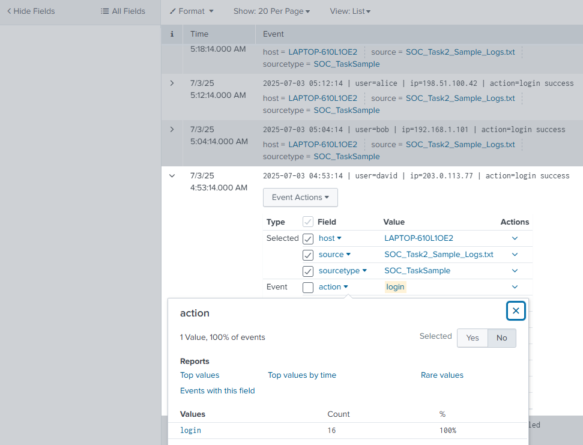
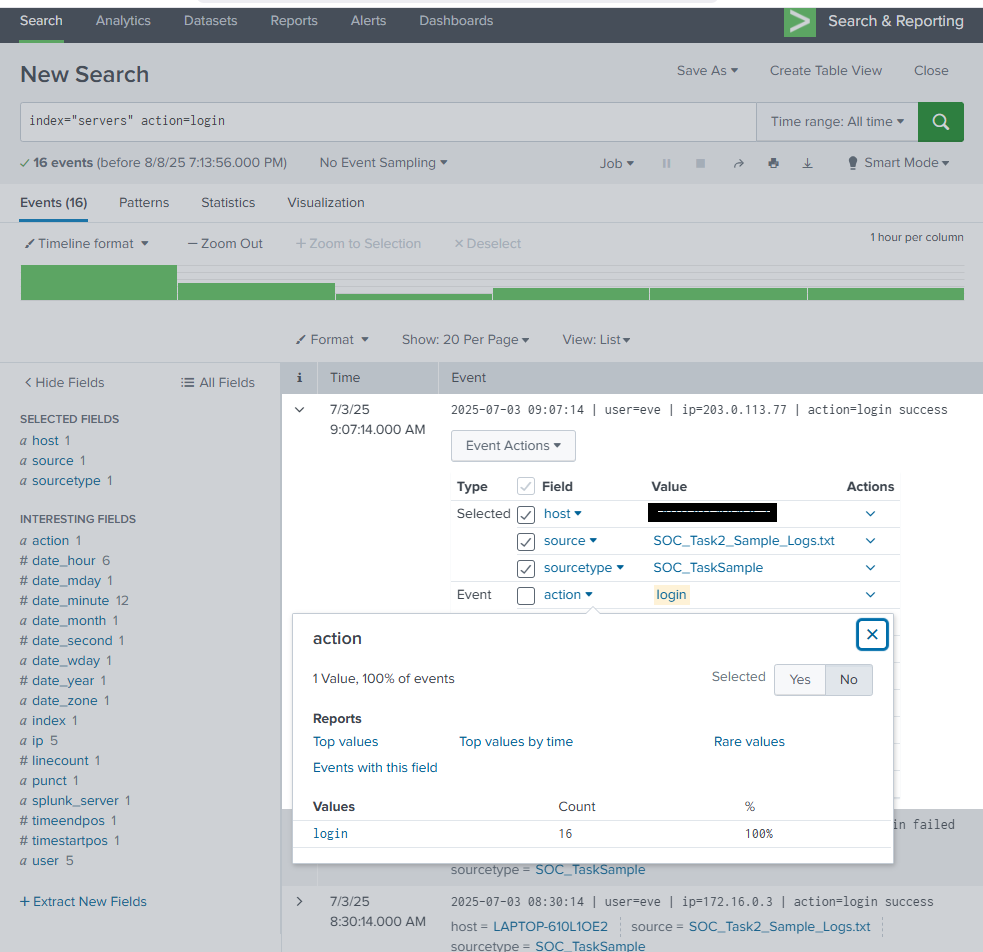

# FUTURE_CS_02

# # 🛡️ Security Alert Monitoring & Incident Response Report  
**Task 2 – SIEM-Based Threat Detection and Response**  

---

## 📋 Task Overview

- **Objective**: Monitor simulated security alerts using a SIEM tool, identify suspicious activities, classify incidents, and draft a response.
- **Tools Used**: 
  - Splunk (Free Trial)
  - Sample Log File
- **Skills Practiced**: 
  - Log Analysis
  - Alert Triage
  - Incident Classification
  - SOC Operations Basics

---
```bash
index="servers"
```


## 📡 1. SIEM Alert Summary

| Alert ID | Tool Used | Source                     | Detected Activity    | Severity | Timestamp |
|----------|-----------|--------|-------------------|----------|-----------|
| A001     | Splunk    | SOC_Task2_Sample_Logs.txt | Malware Deteced| 🔴 High  |2025-07-03 04:29:14   |
| A002     | Splunk    | SOC_Task2_Sample_Logs.txt| File Accessed | 🔴 High  | 2025-07-03 04:53:14 |
| A003   | Splunk    | SOC_Task2_Sample_Logs.txt| Connection Attempt | 🟢 Low  | 2025-07-03 04:18:14  |
| A004    | Splunk    | SOC_Task2_Sample_Logs.txt| Connection Attempt | 🟠 Medium  | 2025-07-03 04:18:14  |
| A005   | Splunk    | SOC_Task2_Sample_Logs.txt|Auth Login Succesful| 🔴 High |2025-07-03 05:12:14  |
---

## 🔍 2. Alert Analysis

```bash
index="server" action=malware
```

### 🚨 A001 – Malware Detected



- **Tool**: Splunk
- **Log Source**:SOC_Task2_Sample_Logs.txt
- **Summary**: Multiple attempts to upload/install a trojan on local system
- **Indicators**:
  - > more than 6 attempts to implement the trojan
  - trojan file
  - Consistent source IP
- **Classification**: **Malicious File** (MITRE ATT&CK T1204.002)

---

### 🌐 A002 – File Accessed

```bash
index="server" action=files
```



- **Tool**: Splunk
- **Log Source**: SOC_Task2_Sample_Logs.txt
- **Summary**: Successful login and access to file on the system
- **Indicators**:
  - File accessed indicator
  - More than 11 times trial to access a file
- **Classification**: **File** (MITRE ATT&CK DS0022)

---

### 💉 A003 – Connection Attempt

```bash
index="server" action=connections
```



- **Tool**: Splunk
- **Log Source**: SOC_Task2_Sample_Logs.txt
- **Summary**: Failed Connection attempts out of office hours
- **Indicators**:
  - Multiple attempts connection but less than 6 hence why its indicated as low
  - consistent ip address
- **Classification**: **Valid Accounts** (MTRE ATT&K T1078.001, T1078.002, T1078.003, T1078.004)

---


### 💉 A004 – Connection Attempt

```bash
index="server" action=logins failed
```



- **Tool**: Splunk
- **Log Source**: SOC_Task2_Sample_Logs.txt
- **Summary**: Failed Connection attempts out of office hours
- **Indicators**:
  - Multiple attempts connection but morethan than 6 hence why its indicated as Medium
  - consistent ip address
- **Classification**: **Valid Accounts** (MTRE ATT&K T1078.001, T1078.002, T1078.003, T1078.004)
---
  
### 🔍 A005 – Auth login Successful

```bash
index="server" action=login successful
```



- **Tool**: Splunk
- **Log Source**: SOC_Task2_Sample_Logs.txt
- **Summary**: user with countless failed login finally logged in
- **Indicators**:
  - More than 11 attempts to connect
  -succesful login from same address with multiple failed login attempts
  - consistent Ip address
- **Classification**: **User Account** (MITRE ATT&CK DS0002)

---

## 🧠 3. Incident Classification Table

| Incident ID | Type                              | Severity | MITRE ID                                 | Status    |
|-------------|-----------------------------------|----------|-------------------------------------------|-----------|
| A001        | Malware                           | High     | T1204.002                                 | Confirmed |
| A002        | File Accessed                     | High     | DS0022                                    | Confirmed |
| A003        | Connection Attempt                | Low      | T1078.001, T1078.002, T1078.003           | Confirmed |
| A004        | Connection Attempt                | Medium   | T1078.001, T1078.002, T1078.003           | Confirmed |
| A005        | Authentication Login Successful   | High     | DS0002                                    | Confirmed |

---


## 🛠️ 4. Remediation & Recommendations


| Alert ID | Alert Title             | Immediate Actions Taken                                                                 | Long-Term Recommendations                                                                                           | Long-Term Mitigation                                                                                               |
|----------|------------------------|------------------------------------------------------------------------------------------|----------------------------------------------------------------------------------------------------------------------|--------------------------------------------------------------------------------------------------------------------|
| 🚨 A001  | Malware Detected        | - Isolate affected system from the network<br>- Quarantine and remove trojan file<br>- Block source IP | - Deploy endpoint detection & response (EDR)<br>- Regular malware signature updates<br>- User awareness training on phishing/malware | - Conduct quarterly malware simulation drills<br>- Maintain centralized malware IOC repository<br>- Continuous behavioral monitoring |
| 🌐 A002  | File Accessed           | - Review access logs for anomalies<br>- Restrict further access to file<br>- Alert SOC team | - Implement role-based access controls (RBAC)<br>- Enable file integrity monitoring<br>- Configure DLP alerts | - Periodic access reviews and least-privilege enforcement<br>- Automate alerts for sensitive file access<br>- Quarterly DLP rule audits |
| 💉 A003  | Connection Attempt (Low)| - Monitor IP for further activity<br>- Add IP to watchlist<br>- Correlate with other logs | - Implement geo-IP filtering if applicable<br>- Apply time-based login restrictions<br>- Improve SIEM alert thresholds | - Continuous network traffic baselining<br>- Use threat intelligence feeds for IP reputation scoring<br>- SIEM rule tuning every 3 months |
| 💉 A004  | Connection Attempt (Medium) | - Block source IP temporarily<br>- Increase monitoring on targeted systems<br>- Alert SOC team | - Implement MFA for remote access<br>- Apply account lockout policies<br>- Strengthen network segmentation | - Annual penetration testing of remote access services<br>- Enforce adaptive authentication<br>- Ongoing red team exercises |
| 🔍 A005  | Auth Login Successful   | - Force password reset for the account<br>- Investigate system activity post-login<br>- Review related failed login attempts | - Enforce MFA on all privileged accounts<br>- Implement anomaly-based login detection<br>- Conduct regular account audits | - Quarterly user access re-certification<br>- Continuous UEBA (User & Entity Behavior Analytics) deployment<br>- Regular phishing awareness campaigns |


---

## 5 🛡 OWASP Top 10 (2021) Compliance Checklist – Mapped to Detected Alerts

This checklist links each OWASP category to related incidents identified during SOC_Task2 analysis.

| ##   | OWASP Category (2021)                           | Related Alert(s) | Description / Relation                                                                                                   | Status ✅/❌ | Notes |
|------|-------------------------------------------------|------------------|---------------------------------------------------------------------------------------------------------------------------|-------------|-------|
| A01  | Broken Access Control                           | A002, A005       | Multiple unauthorized file access attempts and eventual unauthorized login indicate access control gaps.                  | ❌           | Implement strict RBAC, lock accounts after failed attempts. |
| A02  | Cryptographic Failures                          | –                | No encryption-related failures detected in current log review.                                                            | ✅           | Continue monitoring for plaintext data transfers. |
| A03  | Injection                                       | –                | No SQL/command injection indicators found in current dataset.                                                             | ✅           | Maintain WAF filtering and input sanitization. |
| A04  | Insecure Design                                 | A001, A002       | Malware upload attempts and repeated file access suggest lack of secure design in file handling process.                   | ❌           | Review file upload/download handling design. |
| A05  | Security Misconfiguration                       | A001, A004       | Malware detection and repeated failed connections suggest possible misconfigurations in firewall/endpoint security.       | ❌           | Harden system configs and review firewall rules. |
| A06  | Vulnerable and Outdated Components              | –                | No direct evidence, but outdated components may be enabling malware exploitation.                                         | ❌           | Conduct component vulnerability scans. |
| A07  | Identification and Authentication Failures      | A003, A004, A005 | Brute force attempts and eventual success show weak auth protections.                                                     | ❌           | Enforce MFA, lockouts, and strong password policies. |
| A08  | Software and Data Integrity Failures             | A001             | Malware presence could compromise software/data integrity.                                                                | ❌           | Implement code signing and hash validation for software. |
| A09  | Security Logging and Monitoring Failures         | All              | Alerts triggered by Splunk show logging exists, but delayed or post-event detection means improvements are needed.        | ❌           | Enable real-time alerting and SIEM correlation. |
| A10  | Server-Side Request Forgery (SSRF)               | –                | No SSRF activity found in dataset.                                                                                        | ✅           | Continue regular SSRF testing. |

**Legend:**  
✅ = Tested & Compliant  
❌ = Requires Review/Not Compliant

## 📘 6. Lessons Learned

In this task, Splunk was utilized as the primary SIEM tool to monitor, detect, and analyze security events. Effective SIEM operations depend on accurate log parsing and well-configured alerting rules to surface actionable insights.  

Key observations:  
- Splunk efficiently identified suspicious activities when alerts were tuned to specific thresholds and indicators.  
- Incident classification followed the **MITRE ATT&CK** and **OWASP Top 10** frameworks for standardized threat mapping.  
- Correlation between multiple potential log sources (e.g. authentication, connection) remains critical to providing full attack context.  
- Continuous tuning and review of detection rules is necessary to reduce false positives and maintain operational efficiency.  

---

## 📎 7. Appendix

- 🔗 [MITRE ATT&CK Navigator](https://attack.mitre.org/)
- 🔗 [OWASP Top 10 - 2021](https://owasp.org/Top10/)
- 🔗 [Sample Log Dataset Source](https://futureinterns.com/wp-content/uploads/2025/06/SOC_Task2_Sample_Logs.txt)
- 🧰 Tool Configuration Notes:
  - Splunk index for auth logs: `index=server sourcetype=SOC_TaskSample`
    

---

📌 *End of Report*


